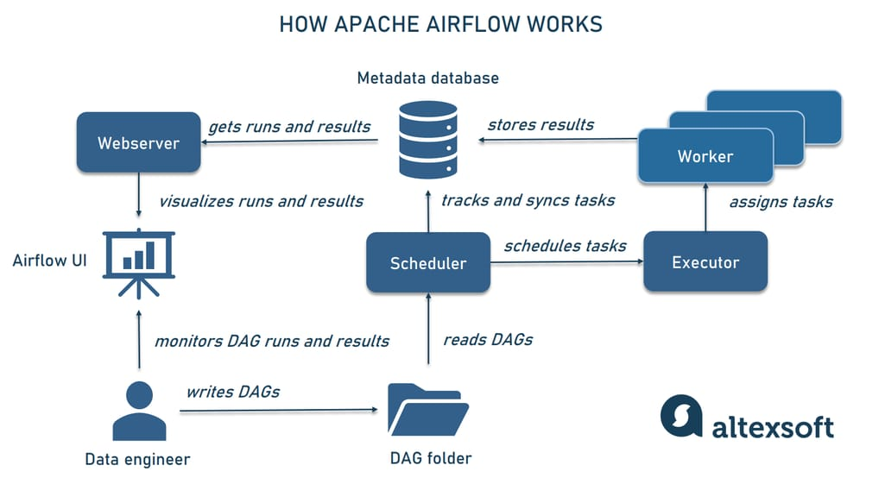

# Apache Airflow

---

-  It is an open-source platform for developing, scheduling, and monitoring batch-oriented workflows.
- Workflows ar defined as python code

## Reasons for Apache Airflow's Popularity
- We know that we can use CRON job scheduler to run scripts but this is till you have 3-5 scripts, but once it starts scaling and you need more granular control then that's where you would use Apache Airflow to organise your workflows
- Airflow let's you specifically define when to run which script/task, what to do if an error occurs etc

## Airflow Architecture
- In Airflow, workflows are represented as DAGs (Directed Acyclic Graph)
    - Directed means that the flow is only in one direction
    - Acyclic means that there are no loops in the flow
    - Graph denotes the visual representation of the flow

### Required Components for Minimal Airflow Installation

**1. Scheduler**

- Responsible for triggering workflows and submitting tasks to the executors (The executor, is a configuration property of the scheduler, not a separate component and runs within the scheduler process)
- Monitors the DAGs and tasks

#### How It Works
- The scheduler at regular intervals keeps scanning the DAG directory for changes and updates
- It determines when a task should start based on its dependencies and schedules it for execution.
- By default, the scheduler checks for tasks to trigger every minute.  

**2. Web Server**
- To run the Airflow UI you require a web server
- The UI provides users the ability to - inspect, trigger and debug behaviour of DAGs

**3. DAG Files Folder**
- Folder containing the tasks which is read by the scheduler to determine which tasks to run and when

**4. Meta Database**
- Used to store state of workflows and tasks
- It uses SQLAlchemy to connect to a DB like MySQL, SQLite, PostgreSQL etc

## Airflow User Roles

- **Deployment Manager** - Manages deployment, configures and installs Airflow
- **DAG Author** - Writes DAGs and submits them to Airflow
- **Operations User** - Person that triggers DAGs and tasks - monitors execution

## What is Apache Airflow used for?

- Airflow works with batch pipelines - sequences of finite jobs, with clear start and end, launched at certain intervals or by triggers. 
- Moving data from one system to another
- End-to-end ML pipelines
- DevOps tasks — for example, creating scheduled backups and restoring data from them.

## What is Apache Airfloe not used for?

- Airflow is not a data processing tool by itself but rather an instrument to manage multiple components of data processing. 
- It’s also not intended for continuous streaming workflows. However, the platform is compatible with solutions supporting near real-time and real-time analytics — such as Apache Kafka or Apache Spark. 
- In complex pipelines, streaming platforms may ingest and process live data from a variety of sources, storing it in a repository while Airflow periodically triggers workflows that transform and load data in batches.

