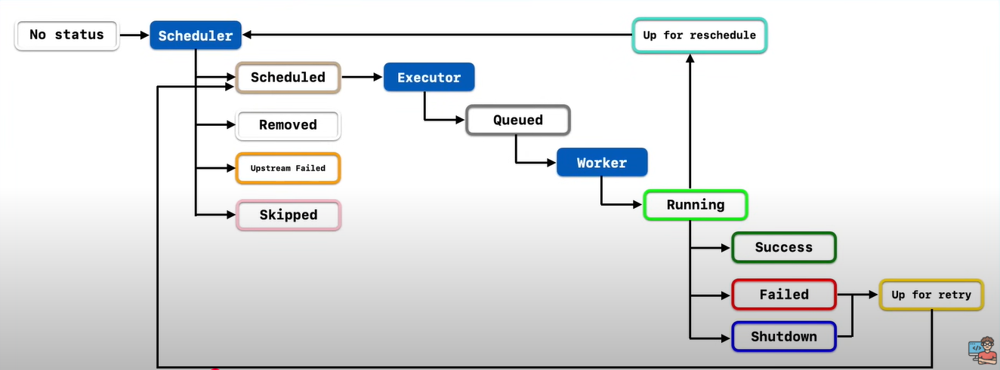

# Technical Details

## Task Lifecycle
The diagram below illustrates the different statuses a task can have
It starts with no status and once it is submitted to the Scheduler it can have either of these 4 status values
- `Scheduled` - scheduled for running
- `Removed` - removed from DAG
- `Skipped` - skipped
- `Upstream Failed` - upstream task before it failed

After being `Scheduled`, a task is submitted to the Executor which assigns it the `queued` status and followed by `running`

Post run, the task could either have
- `Success` - task ran successfully
- `Failed` - task failed
- `Shutdown` - task was not allowed to run / cancelled manualy

Both failed and shutdown tasks can be assigned `up for retry` status if it has not exceeded the max retry limit.

Note that a running task could also have `up for reschedule` status if it needs to run after every certain interval.



## Operators
- An operator defines a unit of work for Airflow to complete. Using operators is the classic approach to defining work in Airflow
- Some of the most popular operators are the PythonOperator, the BashOperator, and the KubernetesPodOperator.

### Bash Operator

```python
import datetime

from airflow.operators.bash import BashOperator
from airflow import DAG

# You can define the default aruguements for a DAG as a dict
default_args = {
    'owner' : 'joyan',
    'retries' : 5,
    'retry_delay' : datetime.timedelta(minutes=2)
}

with DAG(
    dag_id = 'first_dag',
    default_args = default_args,
    descriptiom = 'This is my first DAG',
    start_date = datetime.datetime(2025, 3, 31, 12),
    schedule_interval = '@daily'
) as dag:
    task1 = BashOperator(
        task_id = 'task_1',
        bash_command = 'echo hello world'
    )

```

## XComs
- Stands for cross-communications between tasks
- An XCom is identified by
    - it's name
    - task_id
    - dag_id
- Designed to pass small values of data (not large dataframes)
- You can either push or pull XCom values

**Push XCom**
```python
task_instance.xcom_push(key = "identifier", value = any_serializable_value)
```

**Pull XCom**

```python
task_instance.xcom_pull(key = "identifier", task_ids = "task1")
```

- XComs are a relative of Variables, with the main difference being that XComs are per-task-instance and designed for communication within a DAG run, while Variables are global and designed for overall configuration and value sharing.


## Taskflow API
- TaskFlow API allows you to convert your python code to tasks using the `@task` decorator
-  It also takes care of passing values from one task to another using XComs but you do not need to explicilty call it

```python
from airflow.decorators import task
from airflow.operators.email import EmailOperator

@task # task declared using TaskFlow
def get_ip():
    return my_ip_service.get_main_ip() # return value of get_ip() is automatically passed to compose_email

@task(multiple_outputs=True) # task declared using TaskFlow
def compose_email(external_ip):
    return {
        'subject':f'Server connected from {external_ip}',
        'body': f'Your server executing Airflow is connected from the external IP {external_ip}<br>'
    }

email_info = compose_email(get_ip())

EmailOperator(
    task_id='send_email_notification',
    to='example@example.com',
    subject=email_info['subject'],
    html_content=email_info['body']
)
```


## Setting Up Task Dependencies

``` python
t1.set_downstream(t2)

# This means that t2 will depend on t1
# running successfully to run.
# It is equivalent to:
t2.set_upstream(t1)

# The bit shift operator can also be
# used to chain operations:
t1 >> t2

# And the upstream dependency with the
# bit shift operator:
t2 << t1

# Chaining multiple dependencies becomes
# concise with the bit shift operator:
t1 >> t2 >> t3

# A list of tasks can also be set as
# dependencies. These operations
# all have the same effect:
t1.set_downstream([t2, t3])
t1 >> [t2, t3]
[t2, t3] << t1

```