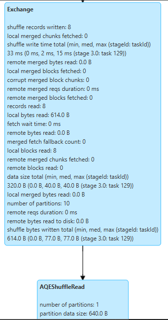

# Shuffle Partitions and Dataframe Partitioning - Are Not The Same

Since starting my journey in data engineering, I have always heard this word 'partition(ing)' and for valid reasons. In simple terms, it is the method of segregating your data into buckets such that you can choose which bucket you want to process and thus save resources.

However, I did face trouble understanding the difference between Shuffle partitions (specific to Apache Spark) and partitioning a dataframe - with this article I hope to clear my doubts in the process and also share my learnings. Los geht's.

## Quick Overview of Partitioning
### What is Partitioning?
It is a technique in which data is split logically into partitions such that each partition can be accessed separately.

### Why Partitioning?
- Better performance - since you don't need to process the complete dataset, you can pick a part of it
- Allows scaling horizontally when the size of the data grows

## 1. Shuffle Partitions
Now, what are shuffle partitions?
Shuffle partitions are the partitions that are created in Apache Spark during a Shuffle operation. 

Quick side note - Shuffle refers to the transfer of data from different nodes into a single destination to perform a certain action like aggregation or a join. However, the key thing to note here is that Shuffle is an expensive operation because you need to transfer data across the network.

### Important Spark Properties for Shuffle Partitions
`spark.sql.shuffle.partitions`: The direct way to specify how many shuffle partitions you want, default value is 200. However, with the advent of Spark's AQE - Spark automatically coalesces this number when needed. 

*Adaptive Query Execution - an optimization technique in Spark SQL that makes use of the runtime statistics to choose the most efficient query execution plan*

Note, AQE can only coalesce post-shuffle partitions and not increase the number of partitions.

## 2. Input DataFrame Partitioning
When you load a dataframe/dataset into Spark, then depending on the size of the data it is split into partitions for optimal processing. This also applies to when reading already partitioned data - 3 possible cases:
1. Too large partition size => repartition to create smaller partitions
2. Too small partition size => coalesce to fewer, larger partitions
3. Optimal size => keep original partitioning

### Important Spark Properties for Input Partitioning
`spark.sql.files.maxPartitionBytes`: Specifies the maximum size of a partition in terms of bytes. The default value is 128MB.

`spark.sparkContext.defaultParallelism`: It determines the number of partitions that Spark will use when processing data. This value is typically based on the number of available cores in your cluster or local machine.


## Real-World Example: Music Listening Activity Analysis

Let's look at a practical example to see how input partitions and shuffle partitions come into picture. I have a listening activity dataset that is partitioned by date:

```
listening-activity-partitioned/
    listen_date=2023-04-26/
        part-00000-ff94d989-8ead-463e-a4c3-fb7e927ec517.c000.snappy.parquet
    listen_date=2023-04-27/
        part-00000-ff94d989-8ead-463e-a4c3-fb7e927ec517.c000.snappy.parquet
    ...
```
Now when I load the whole partitioned parquet file into Spark, the output shows that despite having our data physically partitioned by date in storage, Spark has created 8 input partitions.

```python
# Reading partitioned data
listening_df = spark.read.parquet("listening-activity-partitioned/")
# Input partitioning: Spark automatically uses the date partitioning
print(f"Number of input partitions: {listening_df.rdd.getNumPartitions()}")

# Output:
# Number of input partitions: 8
```
The total data set size is 326.44 KB, which could easily be coalesced into a single partitions but due to spark minimum parallelism configuration, it is split into 8.

```python
print(spark.sparkContext.defaultParallelism)

# Output:
# 8
```

Now, let's see how shuffle partitions come into play when we perform a wide transformation like a group by

```python
# Wide transformation: Finding average listening duration by hour

hourly_stats = listening_df.groupBy("listen_hour") \
    .agg(
        avg("listen_duration").alias("avg_duration"),
        count("activity_id").alias("num_listens")
    ) \
    .orderBy("listen_hour")

# Optimize shuffle partitions since our hourly aggregation will be small
# Default number of shuffle partitions will be 200, we change it to 10
spark.conf.set("spark.sql.shuffle.partitions", 10)
```
On examining the DAG for this transformation you will find that
- `Exchange`: This is where shuffling happens
    - Initially set to 10 partitions (our configuration)
    - AQE (Adaptive Query Execution) optimized it to just 1 partition




## Key Takeaways

- Input partitions are created when reading data into Spark and can be controlled using `repartition()` or `coalesce()`.

- Shuffle partitions are created when Spark shuffles data across nodes during wide transformations. You can set this value using `spark.sql.shuffle.partitions`


I hope this article helped you understand the difference between shuffle partitions and dataframe partitions - it surely helped me!
