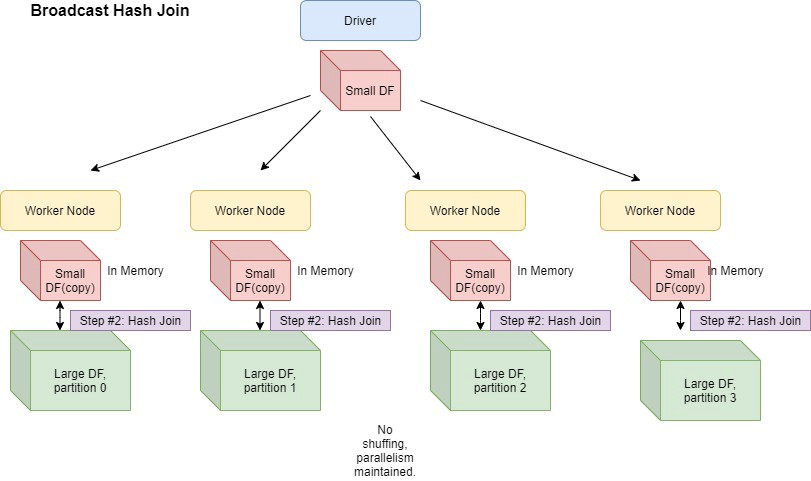

# When to broadcast Vs Redistribute
In distributed data systems it obvious that at some point we need to move data whether it is for a join or a group by operation or it may be for (re)partitioning the dataset.

We will cover broadcast and redistribution or also called as repartitioning as techniques of moving data across nodes. We will mainly focus on when to use which technique and how.

## **Broadcasting**


Source: https://www.linkedin.com/pulse/understanding-broadcast-join-robison-nunes-dos-santos--6hasf/

Broadcasting involves sending a complete copy of a dataset (usually an intermediate result) to all nodes in a cluster. 

### **When to use Broadcasting**
1. When joining two tables, if one table is significantly smaller than the other, the smaller table can broadcasted to all nodes such that the join operation happens within each nodes itself. The default threshold in Spark is 10MB and max allowed is 8GB.

2. The dataset broadcasted is static, example - lookup tables

### **Advantages and Limitations of Broadcasting**

**Advantages**
- Minimizes network traffic
- Simplifies data distribution

**Limitations**
- Not suitable for large datasets
- Potential memory constraints on receiving nodes
- Performance degrades with increasing cluster size

### How to use Broadcasting

```python
from pyspark.sql import SparkSession
from pyspark.sql.functions import broadcast

spark = SparkSession.builder.appName("BroadcastExample").getOrCreate()

# Large dataset
sales_df = spark.read.parquet("sales_data.parquet")

# Small dataset
store_df = spark.read.parquet("store_details.parquet")

# Using broadcast to avoid shuffle
joined_df = sales_df.join(broadcast(store_df), "store_id")

```


## **Repartitioning**
It is the process of redistributing data across a cluster to achieve a more optimal partitioning strategy

### **When to use Repartitioning**
1. When data is not optimally balanced across nodes, i.e. when you have skewed partitions

2. The dataset is large and cannot be broadcasted.

3. If two large datasets are being joined, repartitioning them by the join key ensures that matching records are co-located.

4. If you plan to cache or persist a dataset, repartitioning it beforehand ensures that storage is efficiently used across worker nodes.

### **Advantages and Limitations of Repartioning**

**Advantages**
After optimally repartitioning a dataset you can expect to
- Improves data locality
- Reduces data skew
- Provides a better balance of computational load across worker nodes

**Limitations**
- Involves shuffling of massive amounts of data so should only be used when the performance optimisation is justified


### **How to Use Repartitioning**

**1. `repartition(n)` (Full Shuffle - Expensive)**
- Creates **n new partitions** and **randomly redistributes** data across them.

- **Best used for:**  
  - Increasing the number of partitions for **parallelism**.
  - Handling **imbalanced** partitions.

- **Example:**  
  ```python
  df = df.repartition(10)  # Redistribute data into 10 partitions
  ```

### **2. `repartition(n, col_name)` (Hash Partitioning - Efficient for Joins)**
- Partitions the dataset **based on a column value** (e.g., `customer_id`).
- **Best used for:**  
  - Ensuring that **records with the same key** end up in the same partition before a **join**.
- **Example:**  
  ```python
  df = df.repartition(5, "customer_id")  # Repartition by customer_id
  ```

### **3. `coalesce(n)` (Reduces Partitions - No Shuffle)**
- Reduces the number of partitions **without full shuffle** (tries to merge existing partitions).
- **Best used for:**  
  - When writing final output to storage (e.g., writing **5 large files instead of 100 small ones**).
- **Example:**  
  ```python
  df = df.coalesce(5)  # Reduce partitions without full shuffle
  ```

**When to Use `repartition()` vs. `coalesce()`?**

| Feature | `repartition(n)` | `coalesce(n)` |
|---------|----------------|---------------|
| **Operation** | Full shuffle (expensive) | Merges partitions (no shuffle) |
| **Use Case** | Increasing partitions, handling skew | Reducing partitions efficiently |
| **Performance** | Slower (involves shuffling) | Faster (avoids unnecessary shuffling) |
| **Example** | `df.repartition(10)` | `df.coalesce(5)` |


