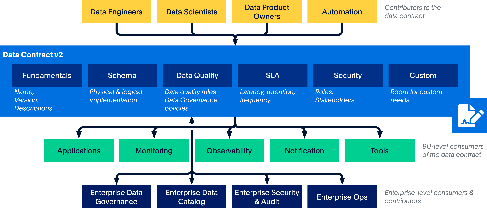

# Data Contracts

## What are Data Contracts?
When I first heard "data contract" - with no background knowledge - I could guess that it is like a contract but for data: how the data is supposed to be structured, what data types are expected, and so on. And my assumption wasn't far fetched from the industry-accepted definition of data contracts. I'm pretty sure if you have some knowledge of data, you too would have this pre-assumed definition.

I like PayPal's definition: *"A data contract defines the agreement between a data producer and consumer"* [1]. 

The goal is simple: to ensure that downstream consumers are assured about data quality and that it's reliable enough to build revenue-generating business applications on top of it, like ML models for pricing algorithms or real-time reports for store managers to monitor inventory.

I'll only refine the paragraph you provided. Here's the improved version:

From another perspective, data contracts function as APIs but specifically for data. Similar to how APIs are utilized across various applications with entire businesses built around providing reliable API services, data contracts must maintain the same level of stability and dependability. 

Data contracts are typically specified using YAML as recommended by the Open Data Contract Standard (ODCS) [4]. YAML is preferred because:
- It's version-control friendly
- It uses a human-readable format
- It can be directly leveraged by various tools

## Motivation Behind Creation of Data Contracts
The concept of data contracts was formally introduced by Andrew Jones in 2021. In his white paper "Data Contracts 101," he outlines the key problems that data contracts aim to solve [2]:

### 1. Lack of Collaboration between Data Producers and Consumers
Throughout his paper, Jones talks about how data producers - backend developers, product managers, etc. - are not fully aware of the business value of data or even the cost of bad data.

We need to understand one thing about data contracts - they make lives easier for data teams, but they mean more work and less freedom for product engineering teams. So it's crucial for consumers to bring data producers onto the same page. Focus on the positive - why good data quality is important, why schema changes shouldn't break existing processes, and how data either generates or saves actual money. For me, this seems to be the most important and difficult part. It's vital to keep the tone in check; we don't want to sound too demanding or bossy ("Enforce this schema!"). Rather, what we're aiming for is fruitful collaboration.

So how does a data contract influence collaboration between data producers and consumers?
It's simple - the whole process of creating and implementing data contracts requires teams to collaborate. A data contract generally consists of (as per [1]):
- Fundamentals - The basics like names, descriptions, etc.
- Schema - Structure of data
- Data quality - Accepted values, data governance policies (PII should be hashed)
- Service-level agreement (SLA) - Refers to latency, retention, data freshness
- Security & stakeholders - Roles and responsibilities
- Custom properties - Custom needs

### 2. No Change Management for Schema Changes
It's obvious that schemas will change as teams add new features, update functionality, or drop certain features for performance reasons. But these schema changes can lead to unwanted consequences downstream, like pipeline breakdowns, broken BI reports, or bad data fed to ML models. Data teams often find themselves just playing catch-up with these changes, and most of their time is invested in fixing issues rather than building actually useful applications.

Jatin Solanki's article [3] summarizes how a typical CI/CD pipeline would look with a data contract integrated:
- Product engineering submits a pull request (PR) to implement any new changes made to the application
- The PR is then reviewed by other team members - adding a data contract is like another set of checks that the code needs to pass
- This way, developers can avoid/restrain from making breaking changes.

## **References**
[1] : https://github.com/paypal/data-contract-template
[2] : https://andrew-jones.com/data-contracts-101/
[3] : https://blog.det.life/data-contracts-a-guide-to-implementation-86cf9b032065
[4] : https://github.com/bitol-io/open-data-contract-standard/tree/main

