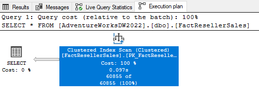

# **Understanding SQL Query Plans**

Query plan analysis helps data engineers optimize SQL queries by understanding how a database engine processes them. Identifying bottlenecks in query execution improves performance, reduces costs, and enhances system efficiency.

### **Types of Query Plans**
- Logical Plan: The high-level plan before physical execution.

- Physical Plan: The final execution plan, including actual operations performed on indexes, tables, and memory

### **Generate Query Plans on Different Platforms**
| Database | Command to Get Query Plan |
|----------|--------------------------|
| PostgreSQL | `EXPLAIN ANALYZE <query>` |
| MySQL | `EXPLAIN <query>` |
| SQL Server | `SET SHOWPLAN_XML ON` |
| Oracle | `EXPLAIN PLAN FOR <query>` |
| Snowflake | `EXPLAIN USING TEXT <query>` |

For PySpark you can use `df.explain()`


###  **Common Terminology for Reading Query Plans**


#### **Data Scans (High to low cost)**
- **Seq Scan (Table Scan)** – Scans entire table (costly, avoidable with indexes).
- **Index Scan** – Uses an index to fetch relevant rows.
- **Index Seek** – Finds a subset of data efficiently using an index.
#### **Join Operation (High to low cost)**
- **Nested Loop Join** – Iterates over two datasets; slow for large joins.
- **Hash Join** – Builds a hash table for efficient joining (better for large datasets).
- **Merge Join** – Merges two sorted datasets (efficient for sorted data).

#### **Other Operations**
- **Sort** – Orders data (avoid unnecessary sorting).
- **Aggregation** – Computes values (SUM, AVG, COUNT).

#### **Metrics to Keep an Eye out (the lesser the value the better)**
- **Execution Time** – The total time a query takes.
- **I/O Cost** – Disk reads and writes.
- **CPU Cost** – Processing required for filtering, sorting, or joining.
- **Memory Usage** – RAM needed for temporary operations (sorting, hashing).

I have used this dataset [linked here](https://learn.microsoft.com/en-us/sql/samples/adventureworks-install-configure?view=sql-server-ver16&tabs=ssms#:~:text=AdventureWorksDW2022.bak) for performing the experiment in MSSQL.

## `SELECT *` Operation

### Using a non-indexed, non-clustered Table

```sql
SELECT * 
FROM [AdventureWorksDW2022].[dbo].[FactResellerSales_HP]
```


### Using a indexed & clustered Table

```sql
SELECT * 
FROM [AdventureWorksDW2022].[dbo].[FactResellerSales]
```




### Comparison
There's isn't much difference in terms of performance as the I/O costs are nearly same, however the logical operation is called Clustered Index Scan for the indexed table.

## `SELECT * ... ORDER BY PK`
### Using a non-indexed, non-clustered Table

```sql
SELECT * 
FROM [AdventureWorksDW2022].[dbo].[FactResellerSales_HP]
ORDER BY SalesOrderNumber
```


### Using a indexed & clustered Table

```sql
SELECT * 
FROM [AdventureWorksDW2022].[dbo].[FactResellerSales]
ORDER BY SalesOrderNumber
```


### Comparison

- Indexed table has only two steps in query execution (Clustered Index Scan and then a SELECT)
- Non-indexed table has 3 steps -> Table scan, Sort and then SELECT. The combined cost of CPU cost of table scan and sorting is much higher than the indexed table. Therefore, it is slower and requires much more work.

## `SELECT * ... WHERE Indexed_Column...`
### Using a non-indexed, non-clustered Table

```sql
SELECT * 
FROM [AdventureWorksDW2022].[dbo].[FactResellerSales_HP]
ORDER BY SalesOrderNumber
```


### Using a indexed & clustered Table

```sql
--CREATE NONCLUSTERED INDEX idx_FactReseller_CTA
--ON [AdventureWorksDW2022].[dbo].[FactResellerSales](CarrierTrackingNumber);

SELECT * 
FROM [AdventureWorksDW2022].[dbo].[FactResellerSales]
WHERE CarrierTrackingNumber = '4911-403C-98'
```


### Comparison

- The second query which uses the indexed column for filtering performs an Index Seek which is the process of quickly locating the specific rows in an index.
- Index Seek reads only 12 rows while the table scan reads the complete table despite the filter
- The second query also has an operation called Key Lookup - this is done to get all the other values other the indexed column value (in the query we have a select *, if we just selected the indexed column value then this step would not be present). Nested Loop joins the Key Lookup and Index Seek results

## Comparing Aggregation Operation on RowStore Vs ColumnStore
### Using a RowStore Table

```sql
SELECT 
	p.EnglishProductName as ProductName,
	SUM(s.SalesAmount) as Amount
FROM [AdventureWorksDW2022].[dbo].[FactResellerSales] s
JOIN [AdventureWorksDW2022].[dbo].[DimProduct] p
ON s.ProductKey = p.ProductKey
GROUP BY p.EnglishProductName

```


### Using a ColumnStore Table

```sql
-- CREATE CLUSTERED COLUMNSTORE INDEX idx_FactResellerSales
-- ON [AdventureWorksDW2022].[dbo].[FactResellerSales_HP]

SELECT 
	p.EnglishProductName as ProductName,
	SUM(s.SalesAmount) as Amount
FROM [AdventureWorksDW2022].[dbo].[FactResellerSales_HP] s
JOIN [AdventureWorksDW2022].[dbo].[DimProduct] p
ON s.ProductKey = p.ProductKey
GROUP BY p.EnglishProductName
```


### Comparison
- Using the columnStore index, the main difference can be seen the in max cost% operation. For the rowStore it is the ClusteredIndexScan of the fact table while for the columnStore it is ColumnStore Index Scan with just 6% of total cost. That is massive amounts of savings
- This is because ColumnStore data is much better suited for aggregated operations.


## **Bottleneck Identification**

Queries more often than not fail due to running into out-of-memory issues or other performance challenges that rack up the bill. Your query might be providing the correct output, but is it the most efficient way? There isn’t a hard-and-fast rule for identifying query bottlenecks, but here are some pointers that can help:

### Understand the Major Cost Operations

Within your query plan, you should be able to identify the percentage of cost or time each operation consumes. For example, if one operation is taking 70% of the cost, focus on optimizing that step. The strategy will naturally depend on what that operation is doing:
- **Full Table Scan:**  
  If you see a full table scan happening when you expect just a few rows, it might be time to check if an index is missing. An index can help the engine jump directly to the rows you need rather than scanning the entire table.
- **Joins and Aggregations:**  
  Look at whether expensive join types (like nested loop joins on large datasets) or aggregations are dominating the cost. Consider whether you can change the join type or pre-aggregate data to reduce processing time.

### Expensive Operations Used When Not Required

Sometimes, the query is doing more work than necessary:
- **Over-fetching Data:**  
  Are you selecting more columns than you actually need (e.g., using `SELECT *`)? Restricting your query to only the necessary columns can reduce the amount of data processed.
- **Inefficient Sorting or Grouping:**  
  Operations like sorting or grouping on large datasets can be very costly. Evaluate if there are ways to minimize these operations, perhaps by ensuring that sorting is done on indexed columns or by pre-sorting data.

### Weighing Trade-offs

Optimization isn’t just about performance—it’s also about balancing maintenance and resource costs:
- **Index vs. Resource Consumption:**  
  Creating an index speeds up query execution but comes with additional storage and maintenance overhead. If you’re running the query just once a month, it might be more efficient to let the query consume extra resources rather than maintaining an index.
- **Partitioning as a Strategy:**  
  If your table is large and the query frequently filters on a specific column (like a date or region), partitioning the table can allow the database to scan only the relevant partition. This is similar to finding a shortcut on a familiar route, saving both time and fuel.

### Using SQL Hints and Query Refactoring

- **SQL Hints:**  
  In some cases, the SQL engine might not choose the most efficient join or scan method. SQL hints can help nudge the optimizer toward a better plan, but use them judiciously.
- **Query Refactoring:**  
  Sometimes, re-writing a query or breaking it into smaller parts (such as using temporary tables or materialized views) can lead to significant performance improvements.

