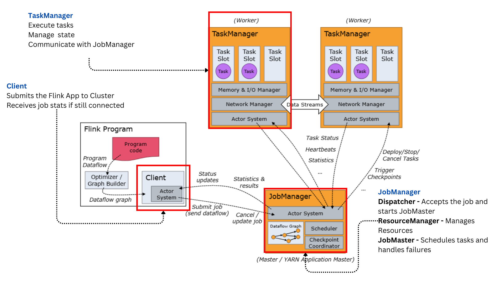

# Apache Flink Basics

Apache Flink is a
- distributed processing engine
- which works with both bounded and unbounded data streams

## **Flink Architecture**

**Component Roles:**

- **Client**: The entry point for users to submit Flink jobs. It compiles the program into a job graph and sends it to the JobManager.

- **JobManager**: Acts as the master node, coordinating the execution of Flink jobs. It consists of:
  - **Dispatcher**: Receives job submissions and initiates a JobMaster for each job.
  - **ResourceManager**: Manages the allocation and provisioning of resources in the cluster.
  - **JobMaster**: Responsible for the execution of a single job, including task scheduling and recovery from failures.

- **TaskManagers**: Serve as the worker nodes that execute the tasks assigned by the JobManager. They manage the state and handle the data processing.




## **Stateful Stream Processing**

### What is a State
State is basically remembering or keeping certain information of the previous events into memory. For instance, keeping track of the running average from sensor readings so as to laert for any anomalies

**Why is a State important?**
It affects how events are handled based on the events that already occured

State may be used for something simple, such as counting events per minute to display on a dashboard, or for something more complex, such as computing features for a fraud detection model.


## **Parts of a Flink Job**

1. Obtaining the execution environment

```python
# For streaming (most common)
env = StreamExecutionEnvironment.get_execution_environment()

# Or for Table API
env = StreamExecutionEnvironment.get_execution_environment()
settings = EnvironmentSettings.new_instance().in_streaming_mode().build()
t_env = StreamTableEnvironment.create(env, settings)
```

2. Configuring the execution environment - how you want the job to run

```python
# Set level of parallelism (how many parallel tasks)
env.set_parallelism(4)

# Set checkpoint interval (for fault tolerance)
env.enable_checkpointing(60000)  # 60 seconds

# Set state backend (where state is stored)
env.set_state_backend(FsStateBackend("file:///checkpoint-dir"))

# Set restart strategy
env.set_restart_strategy(RestartStrategies.fixed_delay_restart(
    3,  # number of restart attempts
    10000  # delay between attempts in milliseconds
))

# Add external JAR dependencies
env.add_jars("file:///path/to/connector.jar")
```

3. We need to load or create the initial data - source

```python
# Built-in sources
data_stream = env.from_collection([1, 2, 3, 4, 5])
data_stream = env.from_elements("a", "b", "c")

# File sources
data_stream = env.read_text_file("/path/to/file")

# Socket source (for debugging)
data_stream = env.socket_text_stream("localhost", 9999)

# Kafka source
properties = {"bootstrap.servers": "localhost:9092", "group.id": "test"}
kafka_stream = env.add_source(
    FlinkKafkaConsumer("topic", SimpleStringSchema(), properties)
)

# In Table API
t_env.execute_sql("""
    CREATE TABLE source_table (
        user_id STRING,
        item_id STRING,
        category_id STRING,
        behavior STRING,
        ts TIMESTAMP(3),
        WATERMARK FOR ts AS ts - INTERVAL '5' SECOND
    ) WITH (
        'connector' = 'kafka',
        'topic' = 'user_behaviors',
        'properties.bootstrap.servers' = 'localhost:9092',
        'format' = 'json'
    )
""")
```

4. Specify the transformations that will be done on the data

```python
# Basic transformations
filtered = data_stream.filter(lambda x: x > 2)
mapped = data_stream.map(lambda x: x * 2)
flat_mapped = data_stream.flat_map(lambda x: [x, x+1, x+2])

# Keyed operations
keyed_stream = data_stream.key_by(lambda x: x["user_id"])
result = keyed_stream.sum(1)  # Sum the second field

# Windows
windowed = keyed_stream \
    .window(TumblingEventTimeWindows.of(Time.seconds(5))) \
    .sum(1)

# Complex processing with Process Functions
result = keyed_stream.process(MyCustomProcessFunction())

# Joins
joined = stream1.join(stream2) \
    .where(lambda x: x["id"]) \
    .equal_to(lambda y: y["id"]) \
    .window(TumblingEventTimeWindows.of(Time.seconds(5))) \
    .apply(MyJoinFunction())

# In Table API
result_table = t_env.sql_query("""
    SELECT user_id, COUNT(*) as visit_count 
    FROM source_table
    WHERE behavior = 'pv'
    GROUP BY TUMBLE(ts, INTERVAL '1' HOUR), user_id
""")
```

5. Specify where to put the results of the computation - sink

```python
# Print sink (for debugging)
result.print()

# File sink
result.write_as_text("/path/to/output", WriteMode.OVERWRITE)

# Kafka sink
result.add_sink(
    FlinkKafkaProducer(
        "output-topic",
        SimpleStringSchema(),
        {"bootstrap.servers": "localhost:9092"}
    )
)

# JDBC sink
result.add_sink(JdbcSink.sink(...))

# In Table API
t_env.execute_sql("""
    CREATE TABLE sink_table (
        user_id STRING,
        visit_count BIGINT
    ) WITH (
        'connector' = 'jdbc',
        'url' = 'jdbc:mysql://localhost:3306/flink',
        'table-name' = 'user_visits'
    )
""")

t_env.execute_sql("""
    INSERT INTO sink_table
    SELECT user_id, visit_count FROM result_table
""")
```

6. Executing the Job

```python
# For DataStream API
env.execute("My Flink Job")

# For Table API with SQL
statement_set = t_env.create_statement_set()
statement_set.add_insert_sql("INSERT INTO sink_table SELECT * FROM result_table")
statement_set.execute()

# Or simpler for a single query
result_table.execute_insert("sink_table").wait()
```

## **DataStream API**
https://nightlies.apache.org/flink/flink-docs-release-2.0/docs/learn-flink/datastream_api/

**When Should you Use DataStream API**
- DataStream API gives a much granular control over the execution
- You have a complex state management requirement
- When you want to create a custom windowing logic

Basically when the high-level API like table and SQL API does not work for you, you can choose to to use DataStream API to gain finer control


## **Table API & SQL API**
https://nightlies.apache.org/flink/flink-docs-release-2.0/docs/dev/table/overview/

Table and SQL API are two relational API offerings by Flink, and it is higher level API than dataStream API. 

This API let's use SQL queries for operations like SELECT, FILTER, JOIN etc

Table API applications begin by declaring a table environment. This serves as the main entry point for interacting with the Flink runtime. It can be used for setting execution parameters such as restart strategy, default parallelism, etc. The table config allows setting Table API specific configurations.

```python
from pyflink.table import EnvironmentSettings, TableEnvironment

# create a streaming TableEnvironment
env_settings = EnvironmentSettings.in_streaming_mode()
table_env = TableEnvironment.create(env_settings)

# or create a batch TableEnvironment
env_settings = EnvironmentSettings.in_batch_mode()
table_env = TableEnvironment.create(env_settings)
```

### Use Table and SQL API in Flink when:

- Working with structured data (rows and columns)
- Familiar with SQL and relational operations
- Need simpler code with less boilerplate
- Working with batch and streaming in unified way
- Performing standard operations like:
  - Filtering/selection
  - Aggregations and grouping
  - Joins
  - Window aggregations

Table/SQL API is generally easier for data analysts and those with database backgrounds, while DataStream API offers maximum flexibility for developers needing precise control.

## **Operators**
https://nightlies.apache.org/flink/flink-docs-master/docs/dev/datastream/operators/overview/

Operators are basically transformations that are applied on datastreams to create a new datastream

1. **Map**
Applies a function to each element of the input stream to produce a new stream

Takes one element and produces one element.

```python
data_stream = env.from_collection(collection=[1,2,3,4, 5]) # this creates a data stream from the given non-empty collection with parallelism = 1

mapped_data_stream = data_stream.map(lambda x: x*2, output_type=Types.INT())
```

2. **FlatMap**

Takes one element and produces zero, one, or more elements.

```python
data_stream = env.from_collection(collection=['hello apache flink', 'streaming compute'])

data_stream.flat_map(lambda x: x.split(' '), output_type=Types.STRING())

```

3. **Filter**

Evaluate a boolean function for each elements and keeps those elements which evaluate to true.

```python
data_stream = env.from_collection(collection=[0,1,2,3,4,5])

data_stream.filter(lambda x: x!=0) # retains only elements not equal to 0

```

4. **KeyBy** (DataStream → KeyedStream)

Logically partitions streams based on a key

```python
data_stream = env.from_collection(collection=[(1, 'a'), (2, 'a'), (3, 'b')])

data_stream.key_by(lambda x: x[1], key_type=Types.STRING()) # key by the second element of the tuple -> 'a', 'b'

```

5. **Reduce** (KeyedStream → DataStream)

A “rolling” reduce on a keyed data stream. Combines the current element with the last reduced value and emits the new value.

```python
data_stream = env.from_collection(collection=[(1, 'a'), (2, 'a'), (3, 'b')])

keyed_data_stream = data_stream.key_by(lambda x: x[1], key_type=Types.STRING()) # key by the second element of the tuple -> 'a', 'b'

keyed_data_stream.reduce(lambda x, y: (x[0] + y[0], y[1])) # A reduce function that creates a stream of partial sums
```

6. **Window** (KeyedStream → WindowedStream)

Windows can be defined on already partitioned KeyedStreams. Windows group the data in each key according to some characteristic (e.g., the data that arrived within the last 5 seconds).

```python
data_stream = env.from_collection(collection=[(1, 'a'), (2, 'a'), (3, 'b')])

keyed_data_stream = data_stream.key_by(lambda x: x[1], key_type=Types.STRING()) # key by the second element of the tuple -> 'a', 'b'

keyed_data_stream.window(TumblingEventTimeWindows.of(Duration.ofSeconds(5)))
```

There are ,many more operators, but these are sufficient to get started.

## **Streaming Analytics with Flink**
https://nightlies.apache.org/flink/flink-docs-release-2.0/docs/learn-flink/streaming_analytics/


https://github.com/apache/flink-training/
