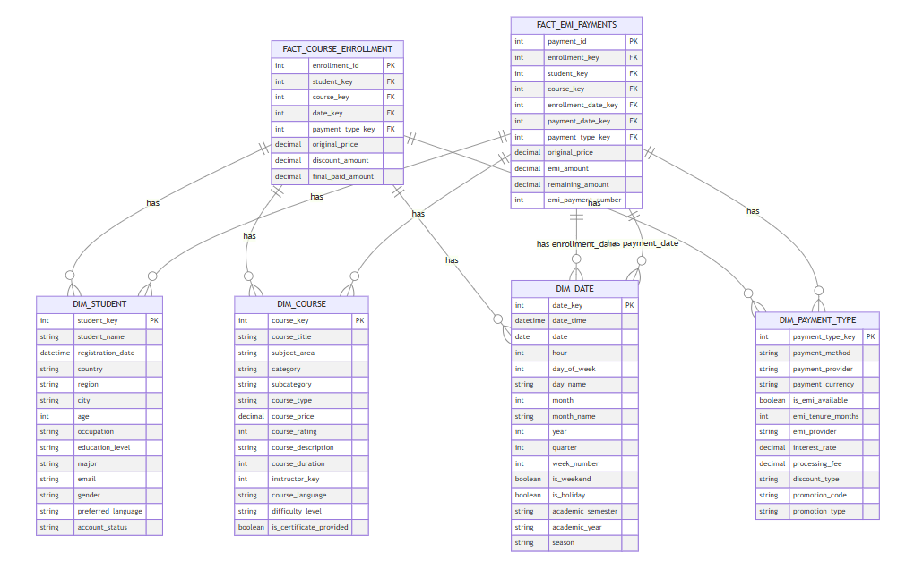

# Dimensional Modelling Examples

## Scenario 1: Hotel bookings
1. Identifying the business process
- In this we would like to capture all the bookings for a hotel

2. Declare Grain
- One Booking request per night per guest
- handles:
    - multiple guests per booking
    - Multiple rooms in one booking
    - Extended stays

3. Identifying Dimensions
- Hotel Name, Region, Country, Date, Hotel Category, Booking Duration, Number of tenants, Booking mode (online/ offline, website / app), dimensions related to guest - loyalty status, nationality

4. Identifying Facts
- Booking Amount, Discount Percent

5. Build Dimensional Tables
    - dim_guest
        - guest_id
        - guest_name
        - contact_info
        - loyalty_status
        - nationality

    - dim_hotel
        - hotel_id
        - hotel_name
        - hotel_category
        - region
        - country

    - dim_room
        - room_id
        - room_type
        - room_category
        - max_occupancy
        - bed_type
        - floor

    - dim_date
        - date
        - hour
        - day_of_week
        - month
        - year
    - dim_booking_info
        - booking_type_id
        - booking_mode
        - booking_duration

6. Build Facts Table
    - fact_booking
        - booking_id
        - hotel_key
        - guest_key
        - room_key 
        - date_key 
        - booking_type_key 
        - number_of_guests
        - number_of_rooms
        - total_nights
        - base_rate
        - additional_charges  
        - taxes
        - total_amount (after discount)

### Model Diagram

## Scenario 2: Online Course Enrollments

### Step 1: Identifying Business Process

- What specific business activity are we trying to track?
    - We are trying to track online course enrollments
- What key business decisions do we need to support with this data?
    - Majorly sales data regarding course enrollments
- Are we tracking just the enrollment itself, or do we need to track course progress and completion as well?
    - No only enrollment 

### Step 2: Declaring the Grain
This is a crucial step that will define the level of detail in our fact table.

1. What does one row in your fact table represent? 
   - One enrollment transaction per student per course

2. What is the most atomic (detailed) level of data you need? Think about:
   - We need to see for each course and each payment for that course by one student. We will assume that a course can be bought by a single user only and not in combination with other users

### Step 3: Identifying Dimensions

Think about all the ways you might want to analyze this enrollment data.

For each dimension you identify, think about:
- Would business users want to filter/group by this?
- Would this help answer important business questions?

1. Who is involved in the enrollment? (Think about the different parties/entities)
    - The course taker - student
    - The instructor(s)

2. When looking at enrollment patterns, what time-related aspects might be important?
    - date of enrollment
    - date of payment
    - if it is EMI based payment then EMI dates 

3. What attributes of the course itself might be interesting for analysis?
    - Course name
    - Course Category
    - Course tags (course provides usually tag course like data engineering, machine learning etc)
    - Course rating
    - Course cost
    - Course duration
    - Course teaching method - is it self paced or instructor led 

4. How do students make these purchases? (Think about the transaction aspects)
    - Direct purchase
    - EMI purchase (probably with the help of a 3rd party payment provider)
    - Any voucher or discount code applied 

5. Are there any special groupings or hierarchies we might want to analyze? (Like course categories, geographic regions, etc.)
    - Demographic attributes of course takers: country, region, city, age, gender, occupation 

### Step 4: Identifying Facts (Measures)

Let's think about the facts based on our grain: 
"One enrollment transaction per student per course"

1. Transaction Facts (These belong in fact table)
   - Original course price (Additive)
   - Discount amount (Additive)
   - Final paid amount (Additive)
   - Number of EMIs (if applicable) (Non-additive)

2. EMI-Related Facts
This is interesting - we have two options here:
   a. Put in main fact table:
      - EMI amount per installment
      - Number of EMIs
   b. Create a separate fact table:
      - FACT_EMI_PAYMENTS with grain "one row per EMI payment"
      

This will keep our model cleaner and more flexible. Let's clearly define both fact tables:

1. FACT_COURSE_ENROLLMENT
   - Grain: "One row per student per course enrollment"
   Facts:
   - original_price (Additive)
   - discount_amount (Additive)
   - final_paid_amount (Additive)
   - payment_type_indicator (EMI/Full) (Non-additive)

2. FACT_EMI_PAYMENTS
   - Grain: "One row per EMI payment"
   Facts:
   - emi_amount (Additive)
   - emi_number (Non-additive, e.g., 1st installment, 2nd installment)
   - remaining_amount (Semi-additive, only across certain dimensions)

### Step 5: Building Dimension Tables

Let's design each dimension table one by one. We'll start with the main dimensions:

#### DIM_COURSE
| Column | Data Type | Part of Hierarchy | SCD|
|--------|-----------|-------------------|----|
| course_id (primary key) | INT | no | no |
| course title | TEXT | No | Yes - type 2 |
| course category | TEXT | Yes | Yes - type 2 |
| course type (self paced / instructor led) | TEXT | No | No |
| course price | DECIMAL | No | Yes - type 2 |
| course rating | INT | No | Yes - type 2 or type 3 |
| course_description | TEXT | No | No |
| course_duration_hours | INT | No | No |
| course_language | TEXT | No | No |
| instructor_key | INT | No | No |

#### DIM_STUDENT
| Column | Data Type | Part of Hierarchy | SCD|
|--------|-----------|-------------------|----|
| student_id (primary key) | INT | no | no |
| student_name | TEXT | No | No|
| registration_date | DATETIME | No | No |
| country | TEXT | No | No |
| region | TEXT | No | No |
| city | TEXT | No | No |
| age | TEXT | No | No |
| gender | ENUM | No | No |
| preferred_language | TEXT | No | No |
| account_status (active, inactive, churn) | TEXT | No | No |
| occupation | TEXT | No | Yes - Type 2 |
| education_level | TEXT | No | No |
| major | TEXT | No | No |

#### DIM_DATE
| Column | Data Type | Part of Hierarchy | SCD|
|--------|-----------|-------------------|----|
| date_time (primary key) | DATETIME (UTC) | no | no |
| date | DATE | no | no |
| hour | HOUR | no | no |
| day_of_week | INT | no | no |
| day_name | TEXT | no | no |
| week_number | INT | no | no |
| month | INT | no | no |
| month_name | TEXT | no | no |
| year | INT | no | no |
| quarter | INT | no | no |

#### DIM_PAYMENT_TYPE
| Column | Data Type | Part of Hierarchy | SCD|
|--------|-----------|-------------------|----|
| payment_type_id (primary key) | INT | no | no |
| payment_method | TEXT | yes | no |
| payment_provider | TEXT | yes | no |
| payment_currency | TEXT | no | no |
| is_emi_available | BOOLEAN | no | no |
| emi_tenure_months | INT | no | no |
| emi_provider | TEXT | no | no |
| interest_rate | DECIMAL | no | Type 2 |
| processing_fee | DECIMAL | no | Type 2 |
| discount_type | TEXT | no | no |
| promotion_code | TEXT | no | no |
| promotion_type | TEXT | no | no |

### Step 6: Building Fact Tables
#### FACT_COURSE_ENROLLMENT
| Column | Data Type | Type |
|--------|-----------|------|
|enrollment_id |INT|Non-additive |
|student_id |INT|Non-additive |
|course_id |INT|Non-additive |
|enrollment_date |DATETIME|Non-additive |
|payment_type_id |DATETIME|Non-additive |
|original_price | FLOAT | Additive |
|discount_amount | FLOAT | Additive |
|final_paid_amount | FLOAT | Additive |

#### FACT_EMI_PAYMENTS
| Column | Data Type | Type |
|--------|-----------|------|
|payment_id |INT|Non-additive |
|student_id |INT|Non-additive |
|course_id |INT|Non-additive |
|enrollment_date |DATETIME|Non-additive |
|payment_date |DATETIME|Non-additive |
|payment_type_id |DATETIME|Non-additive |
|original_price | FLOAT | Additive |
|emi_amount | FLOAT | Additive |
|remaining_amount | FLOAT | Additive |
|emi_payment_number | INT | Non-additive |

### Final Data Model
