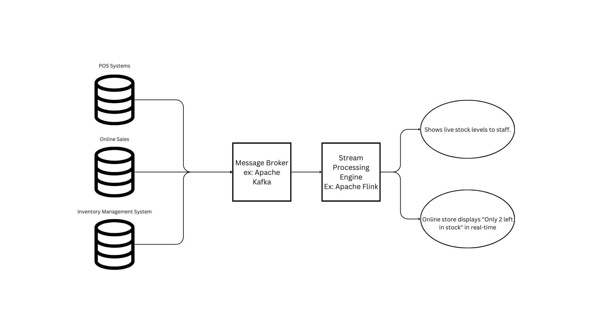

# BATCH PROCESSING - STREAM PROCESSING

- Data Processing: Process of manipulating data to turn it into machine-readable and meaningful format.

## Stream Processing
- Stream processing is the practice of processing data in real-time as it flows into a system, rather than storing it first and analyzing it later. 

### How It Works
1. Data Ingestion: Data is ingested from sources like sensors, applications, or logs.
2. Message Broker: Tools like Kafka act as intermediaries to manage and distribute the stream.
3. Stream Processing Engine: Engines like Apache Flink or Spark Streaming --> analyze, filter, and transform the data.
4. Real-Time Actions: Processed data is sent to databases, dashboards, or triggers automated processes.

### Use Cases
####  Real-Time Inventory Tracking (E-commerce & Retail)
**Data Flow**
- Each purchase, return, or inventory update generates an event (e.g., “2 items of product X sold”).
- These events are sent to a message broker like Apache Kafka.
- A stream processing engine (e.g., Apache Flink or Spark Streaming) processes the events in real time.

**Outcomes**
- Inventory Dashboard Updates: Shows live stock levels to staff.
- Customer-Facing Systems: Online store displays "Only 2 left in stock" in real-time.
- Automated Alerts: Triggers reorders when stock falls below a threshold.

## Batch Processing
Batch processing involves collecting and processing large volumes of data at once, typically on a scheduled basis (e.g., hourly, daily, or weekly). 

It’s ideal for tasks that don’t require immediate results and focuses on efficiency over real-time performance.

### How Batch Processing Works

1. Data is gathered over a period of time from various sources (e.g., databases, logs, files).  
2. The collected data is ingested into a processing system like Hadoop or Spark.  
3. Operations such as aggregations, transformations, and calculations are applied.  
4. The results are stored in a data warehouse or database for reporting and analysis.  

### When to Use Batch Processing

- Historical analysis and long-term trend detection.  
- Data that doesn't require immediate insights (e.g., end-of-day sales reports).  
- Processing large datasets with computationally intensive tasks (e.g., training ML models).  
    

## **Batch vs. Stream Processing**  

| **Aspect**           | **Batch Processing**                       | **Stream Processing**            |
|----------------------|----------------------------------------|----------------------------------|
| **Data Input**       | Large datasets processed at intervals   | Continuous data streams          |
| **Latency**          | High (hours or days)                    | Low (milliseconds to seconds)    |
| **Processing Speed** | High throughput, slower results         | Low throughput, immediate results|
| **Cost Efficiency**  | Cost-effective for periodic jobs        | Costlier due to continuous operation |
| **Use Cases**        | Reports, analytics, machine learning training | Fraud detection, monitoring, personalization |

