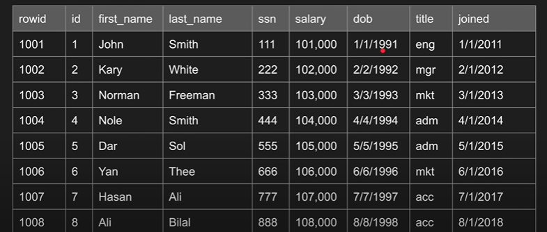
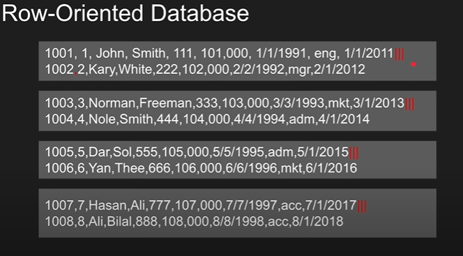
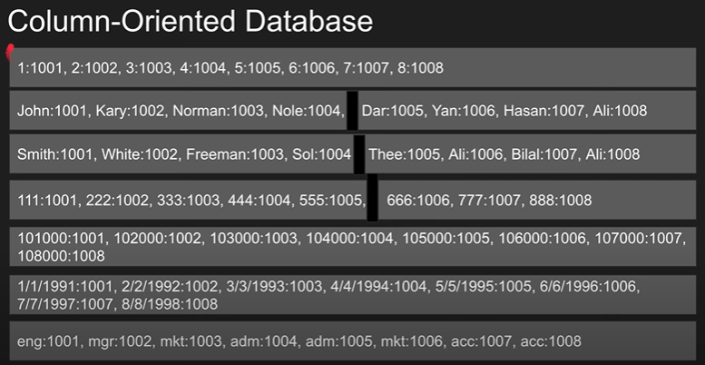

# Row Vs Column Oriented Databases
We are going to mainly cover how row-oriented databases work and how column-oriented databases work.
Follows from this video: https://youtu.be/Vw1fCeD06YI?si=w70-xS5d7wAm6Hu8

### Sample table 
We will be working with this table for understanding the difference

## Row-oriented DB (Row Store)
- The data is stored in sequential format, check the image below

- Each row of data is stored in one block (just for illustration - in real world it could be split in multiple blocks or multiple rows can  be placed in a single block)

### WHERE Clause
- If I have a query like `SELECT * FROM sample_table WHERE id = 5`
- Then the DBMS would need to sequentially scan all the blocks till it finds the row with `id = 5`
- Moreover, instead of `SELECT *`, if the query was just `SELECT first_name` then we just read unnecessary amount of data - not efficient

### Aggregation
- `SELECT sum(salary) FROM sample_table`
- Again with this query all the blocks and all the columns within that block would need to be read in order to complete the aggregation operation, `SUM` in this case

## Column-oriented Database (Column-store / Columnar)
- Visualising how columnar DB stores data 

- Notice that now each block of memory holds value from a single column along with the row_ids

### WHERE Clause
- Analysing the working of the same query `SELECT * FROM sample_table WHERE id = 5`
- In this case the DBMS can jump straight to the block where ids are stored and fetch the row_id.
- However, the issue arises with `SELECT *` because now the DBMS has to incur a lot of IO because it needs to fetch values from all the blocks. That's why it's not recommended to select all columns when working with columnar

### Aggregation
- `SELECT sum(salary) FROM sample_table`
- The aggregation query however will be much cheaper as all the values are in one block

## Comparision
| Row-based | Column-based|
|-----------|-------------|
| Optimal for read/write operations | Writes are slower
| Preferred for OLTP - simpler implementation| Preferred for OLAP - cheaper aggregations|
| Compresssion isn't efficient| Efficient compression because of repeating values|
| Aggregation isn't efficient| Efficient aggregation|
| Efficient queries when with multiple cols| Don't use `SELECT *` here!|
